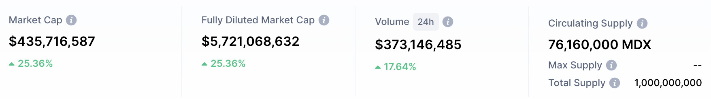

[中文版](#fip-0002-%E6%96%B0%E8%B5%84%E4%BA%A7---mdx)

[English Version](#fip-0002-new-asset---mdx)

# FIP-0002 新资产 - MDX

### 提案内容

FIlDA 支持MDX借贷。
MDX质押率初始为0%，后续调整将经过DAO投票决定。

--------------------------------

附 MDX 借贷功能补充资料，便于 FilDA DAO 投票者增加对提案的了解。

### 1，增加 MDX 借贷功能上线动因：

MDEX 在 HECO 生态中有重要的不可替代作用，因独有的经济模型，MDX 的迅速在 HECO 上占据了 HECO 头部的 DEX 的位置。增加 MDX 借贷功能，可以丰富 FilDA 资产种类，满足更多用户借贷需求。

### 2，增加新资产借贷风险提示：

#### 1）价格波动风险
初始 MDX 质押率设置为0，即用户可存入MDX，MDX 可以被借出，MDX 不能作为质押品。
MDX 作为借出品时，即用户质押其他资产借出 MDX 时，可能因 MDX 价格快速上涨导致贷款使用率上涨，若贷款使用率达到 100%将引发清算。
用户借出 MDX 时需要注意相关价格波动及风险。

#### 2) 安全性风险
DeFi 项目由于本身的去中心化特性，安全性始终是较大的风险点。
MDX 目前已通过慢雾 SlowMist，灵踪科技 FairyProof，Certik 三家安全公司的审计，同时在上线以来经过大规模资金的使用，合约和资产安全风险相对较低，

#### 3）流动性风险
MDX 目前流动性深度约4.5亿美金，流动性风险低
数据参考 

https://info.mdex.com/#/token/0x25d2e80cb6b86881fd7e07dd263fb79f4abe033c

### 3，MDEX 利率设置相关说明
MDX 的借款利率模型与其他资产相比将波动更大，需平衡存款人与借款人的利益，以下数值可能由团队根据实际情况变化。

#### 1）基础利率：参考 MDEX 的 boardroom 里的 MDX 质押 APY，MDX 借款的初始基础利率设定为50%，后续将随着 MDX在 FilDA 平台存借实际情况而调整。
MDEX Boardroom

链接 https://mdex.com/#/boardroom

#### 2）MDX 拐点利率模型中，第一阶梯拐点增长为 MDX 资金使用率为 50%，资金使用率每上升1%，利率上涨 15%，第二阶梯拐点MDX资金使用率为 90%，每使用率每上升 1%，利率上涨 30%

利率模型介绍

https://docs.filda.io/ye-wu-liu-cheng/li-lv-mo-xing-interest-model

### 4，MDX 币种风控限制
为降低系统风险、保护用户权益，以下情况可能触发存款限制，即用户不可再存入MDX，期间可取款MDX或借走MDX。
1）24小时内 MDX 价格上涨超过50%，触发存款限制。
2）目前设置MDX总供应量等值1000万美金上限，触发存款限制。

### MDEX概况

#### 1，MDEX 介绍
MDEX 是 HECO 上基于自动化做市机制的去中心化交易产品。
根据 Coinmarketcap 及 Coingecko数据，Mdex 日交易量排名全球第一，为第二名到第四名Uniswap, Pancakeswap，Sushiswap 的总和。

Top Decentralized Exchanges by Trading Volume

https://coinmarketcap.com/rankings/exchanges/dex/

https://www.coingecko.com/en/dex

#### 2，MDEX数据概览
https://mdex.com/#/

#### 3，MDX代币
1）代币交易情况
https://www.defibox.com/markets/mdex?chain=heco

https://mdex.com/#/

2）代币总量等

# FIP-0002 New asset - MDX
MDX will be added into the banking protocol on FilDA if the DAO voting polls in its favour. The initial liquidation threshold for MDX is 0% and the subsequent liquidation threshold will be adjusted through further DAO voting.
Additional information on MDX lending/borrowing is attached to facilitate DAO voters’ understanding of this proposal. 

### 1. Why add MDX into banking protocol :
MDEX plays an important and irreplaceable role in the HECO ecology. Due to its unique economic model, MDX quickly becomes one of the top DEXs on HECO. Adding borrowing/lending features for MDX can enrich FilDA's asset types and meet the user needs.

### 2. Risk Analysis:

#### 1) Price volatility risk
The initial liquidation threshold for MDX is set to 0%. In other words, users can either deposit or borrow MDX but cannot use it as collateral. When users borrow MDX after collateralizing other assets on FilDA, the rapid increase in the price of MDX may cause the rapid increase of the loan utilization rate. If the loan utilization rate reaches 100%, liquidation will be triggered. Users need to pay attention to this risk due to the price fluctuations when borrowing MDX.

#### 2) Security risk
Due to the decentralized nature of the DeFi project, security is always a concern. MDX has passed the audits of SlowMist, FairyProof, and Certik. Besides, it has provided services for many large funds since its launch, so the security risk is relatively low.

#### 3) Liquidity risk
MDX's current market depth is about $450 million, so MDX has a low liquidity risk. Please refer the data in the below link: 

https://info.mdex.com/#/token/0x25d2e80cb6b86881fd7e07dd263fb79f4abe033c

### 3. About the interest rate of MDX
MDX's interest rate model will be more volatile than other assets. Such volatility is necessary to balance the interests of lenders and borrowers. The following values ​​may be adjusted by the team based on actual circumstances.

#### 1) Basic interest rate: We will refer to the MDX pledge APY in the boardroom on MDX website. The initial basic rate of MDX loans is 50%, which will be adjusted in accordance with the actual deposits/loans situation on the FilDA platform.
Here is MDEX Boardroom link:  

https://mdex.com/#/boardroom

#### 2) In the segmented interest model for MDX, when asset utilization rate exceeds 50%, the interest rate increases by 15% when asset utilization rate increases by 1%; when asset utilization rate exceeds 90%, the interest rate increases by 30% when asset utilization rate increases by 1%.

Please refer to Introduction to interest rate models in the below link: 

https://docs.filda.io/ye-wu-liu-cheng/li-lv-mo-xing-interest-model

#### 4. MDX risk control restrictions
In order to reduce system risks and protect the asset security for users, the system may trigger deposit restrictions (users can no longer deposit MDX but can withdraw or borrow MDX during that period) in the following circumstances:

1) The price of MDX increases by more than 50% within 24 hours.
2) The value of the total supply of MDX exceeds the limit of USD 10 million.

### MDEX overview

#### 1. Introduction to MDEX
MDEX is a decentralized trading product based on an automated market-making mechanism on HECO. According to coinmarketcap and coingecko data, Mdex's daily trading volume ranks first in the world, and is the sum of Uniswap, Pancakeswap, and Sushiswap from second to fourth.
Top Decentralized Exchanges by Trading Volume 

https://coinmarketcap.com/rankings/exchanges/dex/ 

https://www.coingecko.com/en/dex

#### 2. MDEX data overview
https://mdex.com/#/

#### 3. MDX tokens
1) Token transaction situation

https://www.defibox.com/markets/mdex?chain=heco

2) Total amount of tokens, etc.

